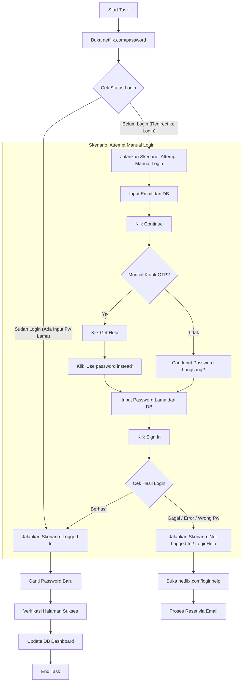

# Implementasi Canggih Netflix Auto Reset Bot (V2)

Dokumen ini merinci alur kerja baru yang lebih cerdas, di mana bot mencoba melakukan login manual sebelum memutuskan untuk menggunakan jalur reset email.

## 1. Alur Kerja Utama

## 2. Detail Elemen & Locator (Referensi HTML)

### A. Halaman Identitas (Langkah 1-2)
*   **Email Input**: `data-uia="field-userLoginId"`
*   **Continue Button**: `data-uia="continue-button"`

### B. Halaman OTP / Get Help (Langkah 3-5)
*   **OTP Entry**: `data-uia="pin-entry"` (Pastikan ada 4 kotak)
*   **Get Help**: Teks "Get Help" atau class `e1vs384d0`
*   **Use Password Instead**: `data-uia="usePasswordInsteadHelpMenuItem"`

### C. Halaman Password & Sign In (Langkah 6-8)
*   **Password Input**: `data-uia="password-input"`
*   **Sign In Button**: `data-uia="sign-in-button"`

## 3. Logika Penanganan Error Khusus

| Kondisi | Tindakan Bot |
| :--- | :--- |
| **Password Salah** | Jangan ulangi login manual. Langsung arahkan ke `netflix.com/loginhelp`. |
| **Something Went Wrong** | Ulangi langkah `Sign In` maksimal 2x. Jika tetap error, pindah ke `loginhelp`. |
| **Akun Terkunci (Locked)** | Kirim status `NEED_ACTION` ke dashboard dan berhenti. |
| **Diminta Verifikasi HP** | Langsung pindah ke `loginhelp` untuk menghindari blokir permanen. |

## 4. Verifikasi Akhir (Sama seperti V1)
*   Menunggu halaman `addphone` atau `passwordUpdated=success`.
*   Klik "Tidak, Terima Kasih" jika muncul.
*   Tunggu 10 detik sebelum menutup browser.
