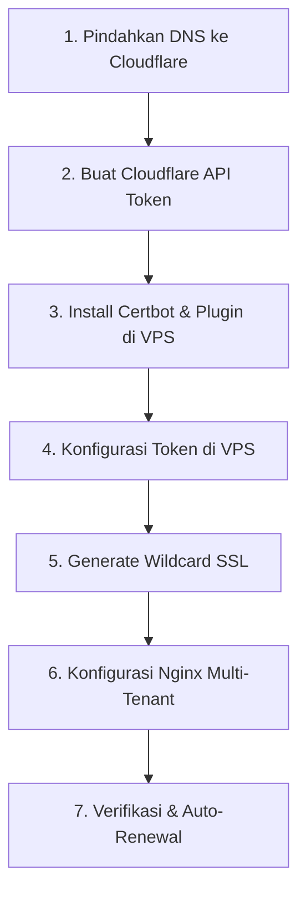

# ☁️ Panduan Lengkap Penerapan Wildcard SSL via Cloudflare & Nginx

Panduan ini dirancang untuk memandu Anda langkah demi langkah dalam menerapkan **Wildcard SSL (`*.digitalpremium.id`)** menggunakan **Cloudflare DNS** dan **Certbot** di VPS Linux Anda. 

Dengan metode ini, setiap kali ada tenant baru mendaftar (misal: `paytronik.digitalpremium.id`, `capital.digitalpremium.id`, dll), subdomain tersebut **otomatis aktif dengan HTTPS** tanpa perlu Anda menyentuh konfigurasi VPS lagi!

---

## 🗺️ Peta Jalan Implementasi



---

## 📋 Langkah 1: Pindahkan Nameserver Domain ke Cloudflare

Langkah pertama adalah mendelegasikan DNS management domain Anda (misal yang dibeli di Rumahweb) ke Cloudflare.

1. **Buat Akun / Login** ke [Cloudflare Dashboard](https://dash.cloudflare.com/).
2. Klik tombol **Add a Site**, lalu masukkan domain Anda (contoh: `digitalpremium.id`).
3. Pilih paket **Free (Gratis $0)**, lalu klik **Continue**.
4. Cloudflare akan memindai DNS record Anda saat ini secara otomatis. Jika sudah, klik **Continue**.
5. Anda akan diberikan **2 Nameserver Cloudflare** baru, contoh:
   * `lara.ns.cloudflare.com`
   * `toby.ns.cloudflare.com`
6. **Buka Panel Domain Rumahweb** (atau tempat Anda membeli domain), cari menu **Change Nameservers**, lalu ganti nameserver bawaan lama Anda dengan 2 Nameserver Cloudflare tadi.
7. Kembali ke Cloudflare, klik **Done, check nameservers**. 
   > [!NOTE]
   > Proses pergantian DNS (propagasi) biasanya memakan waktu 5 menit hingga maksimal 24 jam. Jika sudah aktif, Anda akan menerima email konfirmasi dari Cloudflare bahwa domain Anda sudah "Active".

---

## 🔑 Langkah 2: Buat API Token Khusus di Cloudflare

Agar Certbot di VPS dapat mengonfirmasi kepemilikan domain Anda secara otomatis melalui DNS Challenge, Anda perlu membuat API Token khusus.

1. Di pojok kanan atas Cloudflare Dashboard, klik ikon profil Anda, lalu pilih **My Profile**.
2. Pada menu sebelah kiri, klik **API Tokens**, lalu klik **Create Token**.
3. Di bagian **Edit zone DNS**, klik **Use template**.
4. Atur konfigurasinya sebagai berikut:
   * **Token Name**: `Certbot Wildcard DNS Token`
   * **Permissions**:
     * `Zone` ➔ `DNS` ➔ `Edit`
   * **Zone Resources**:
     * `Include` ➔ `Specific zone` ➔ *(Pilih domain Anda, misal: `digitalpremium.id`)*
5. Klik **Continue to summary**, lalu klik **Create Token**.
6. **Salin (Copy) API Token** yang muncul di layar. Simpan di notepad Anda sementara karena token ini **hanya akan ditampilkan sekali**.

---

## 📦 Langkah 3: Install Certbot & Cloudflare DNS Plugin di VPS

Hubungkan ke VPS Linux Anda menggunakan SSH (misal via Putty atau Terminal), lalu install package Certbot beserta plugin DNS Cloudflare.

> [!TIP]
> Jalankan perintah update system terlebih dahulu sebelum menginstal packages.

**Untuk Ubuntu / Debian:**
```bash
sudo apt update
sudo apt install -y certbot python3-certbot-cloudflare
```

**Untuk CentOS / Rocky Linux:**
```bash
sudo dnf install -y epel-release
sudo dnf install -y certbot python3-certbot-cloudflare
```

---

## 💾 Langkah 4: Simpan API Token Cloudflare di VPS

Buat berkas konfigurasi rahasia untuk menyimpan API Token yang Anda buat di Langkah 2 agar Certbot dapat membacanya dengan aman.

1. Buat direktori rahasia `.secrets` di home directory:
   ```bash
   mkdir -p ~/.secrets
   chmod 700 ~/.secrets
   ```

2. Buat file `.secrets/cloudflare.ini` menggunakan text editor (misal `nano`):
   ```bash
   nano ~/.secrets/cloudflare.ini
   ```

3. Masukkan teks berikut ke dalam berkas tersebut (ganti `TOKEN_CLOUDFLARE_ANDA` dengan API Token asli yang Anda salin pada Langkah 2):
   ```ini
   # Cloudflare API token yang digunakan oleh Certbot
   dns_cloudflare_api_token = TOKEN_CLOUDFLARE_ANDA
   ```

4. Simpan file tersebut (Tekan `CTRL+O`, lalu `ENTER`, dan `CTRL+X` untuk keluar dari nano).
5. Atur hak akses agar hanya user root/current user yang bisa membaca berkas sensitif ini:
   ```bash
   chmod 600 ~/.secrets/cloudflare.ini
   ```

---

## ⚡ Langkah 5: Generate Sertifikat Wildcard SSL

Kini saatnya meminta Let's Encrypt menerbitkan sertifikat SSL ganda yang mencakup domain utama Anda dan seluruh subdomain di bawahnya secara tidak terbatas (`*.digitalpremium.id`).

Jalankan perintah Certbot berikut di terminal VPS (ganti `digitalpremium.id` dengan domain Anda yang sebenarnya, dan sertakan email aktif Anda untuk peringatan perpanjangan):

```bash
sudo certbot certonly \
  --dns-cloudflare \
  --dns-cloudflare-credentials ~/.secrets/cloudflare.ini \
  --dns-cloudflare-propagation-seconds 30 \
  --agree-tos \
  --no-eff-email \
  -m email-anda@gmail.com \
  -d digitalpremium.id \
  -d *.digitalpremium.id
```

### 🎉 Apa yang terjadi jika sukses?
Certbot akan menampilkan teks konfirmasi keberhasilan seperti berikut:
```text
Successfully received certificate.
Certificate is saved at: /etc/letsencrypt/live/digitalpremium.id/fullchain.pem
Key is saved at:         /etc/letsencrypt/live/digitalpremium.id/privkey.pem
This certificate expires on 2026-08-16.
```

---

## 🌐 Langkah 6: Konfigurasi Nginx Server Block (Satu untuk Semua)

Setelah sertifikat berhasil disimpan di VPS, Anda perlu mengonfigurasi Nginx agar secara dinamis menangkap semua subdomain tenant tanpa perlu membuat konfigurasi server block satu per satu.

1. Buka file konfigurasi Nginx situs Anda (misal `/etc/nginx/sites-available/digitalpremium`):
   ```bash
   sudo nano /etc/nginx/sites-available/digitalpremium
   ```

2. Masukkan konfigurasi Nginx cerdas berbasis Regex berikut (sesuaikan nama domain utama):
   ```nginx
   # 1. Alihkan semua HTTP ke HTTPS otomatis untuk keamanan
   server {
       listen 80;
       listen [::]:80;
       server_name .digitalpremium.id; # Titik didepan mencakup domain utama & seluruh subdomain
       return 301 https://$host$request_uri;
   }

   # 2. Server Block Utama HTTPS (Menangkap semua subdomain secara dinamis)
   server {
       listen 443 ssl http2;
       listen [::]:443 ssl http2;
       server_name ~^(?<tenant>.+)\.digitalpremium\.id$;

       # Path sertifikat Wildcard SSL yang di-generate pada Langkah 5
       ssl_certificate /etc/letsencrypt/live/digitalpremium.id/fullchain.pem;
       ssl_certificate_key /etc/letsencrypt/live/digitalpremium.id/privkey.pem;

       # Optimasi Keamanan SSL
       ssl_protocols TLSv1.2 TLSv1.3;
       ssl_prefer_server_ciphers on;
       ssl_ciphers ECDHE-ECDSA-AES128-GCM-SHA256:ECDHE-RSA-AES128-GCM-SHA256:ECDHE-ECDSA-AES256-GCM-SHA384:ECDHE-RSA-AES256-GCM-SHA384;
       ssl_session_cache shared:SSL:10m;
       ssl_session_timeout 1d;

       location / {
           proxy_pass http://localhost:3000; # Port Frontend (Dashboard/Landing Page)
           proxy_http_version 1.1;
           proxy_set_header Upgrade $http_upgrade;
           proxy_set_header Connection 'upgrade';
           proxy_set_header Host $host;
           proxy_cache_bypass $http_upgrade;

           # Header Khusus untuk Mengirim nama Subdomain/Tenant ke Aplikasi
           proxy_set_header X-Tenant-ID $tenant; 
           proxy_set_header X-Real-IP $remote_addr;
           proxy_set_header X-Forwarded-For $proxy_add_x_forwarded_for;
           proxy_set_header X-Forwarded-Proto $scheme;
       }
   }

   # 3. Server Block HTTPS khusus untuk domain utama (digitalpremium.id dan www)
   server {
       listen 443 ssl http2;
       listen [::]:443 ssl http2;
       server_name digitalpremium.id www.digitalpremium.id;

       ssl_certificate /etc/letsencrypt/live/digitalpremium.id/fullchain.pem;
       ssl_certificate_key /etc/letsencrypt/live/digitalpremium.id/privkey.pem;

       location / {
           proxy_pass http://localhost:3000; # Port Frontend Landing Page Utama
           proxy_http_version 1.1;
           proxy_set_header Upgrade $http_upgrade;
           proxy_set_header Connection 'upgrade';
           proxy_set_header Host $host;
           proxy_cache_bypass $http_upgrade;
           proxy_set_header X-Real-IP $remote_addr;
           proxy_set_header X-Forwarded-Proto $scheme;
       }
   }
   ```

3. Simpan berkas tersebut (`CTRL+O`, `ENTER`, `CTRL+X`).
4. Uji apakah sintaks Nginx Anda sudah benar dan bebas dari error:
   ```bash
   sudo nginx -t
   ```
5. Jika hasilnya `syntax is ok` & `test is successful`, muat ulang Nginx untuk menerapkan sertifikat baru:
   ```bash
   sudo systemctl reload nginx
   ```

---

## 🔄 Langkah 7: Otomatisasi Perpanjangan SSL (Auto-Renewal)

Sertifikat SSL Let's Encrypt berlaku selama **90 hari**. Namun, karena kita menggunakan plugin Cloudflare DNS, Certbot secara otomatis menjadwalkan perpanjangan otomatis di VPS Anda!

1. Anda dapat menguji proses perpanjangan tiruan (*dry-run*) untuk memastikan script auto-renewal berjalan lancar tanpa kendala:
   ```bash
   sudo certbot renew --dry-run
   ```
2. Jika output menampilkan `Congratulations, all simulated renewals succeeded`, maka perpanjangan SSL Anda **100% aman dan akan diperpanjang otomatis selamanya** setiap 60 hari sekali di VPS Anda!

---

## 🏆 Kiat Sukses Cloudflare (Penting!)
Di dashboard Cloudflare Anda:
1. Masuk ke menu **SSL/TLS** ➔ **Overview**.
2. Pastikan mode enkripsi diset ke **Full (Strict)**. Ini memastikan komunikasi terenkripsi penuh dari browser ➔ Cloudflare ➔ VPS Anda.
3. Di menu **SSL/TLS** ➔ **Edge Certificates**, Anda bisa mengaktifkan **Always Use HTTPS** dan **Automatic HTTPS Rewrites** agar website selalu aman secara global.
