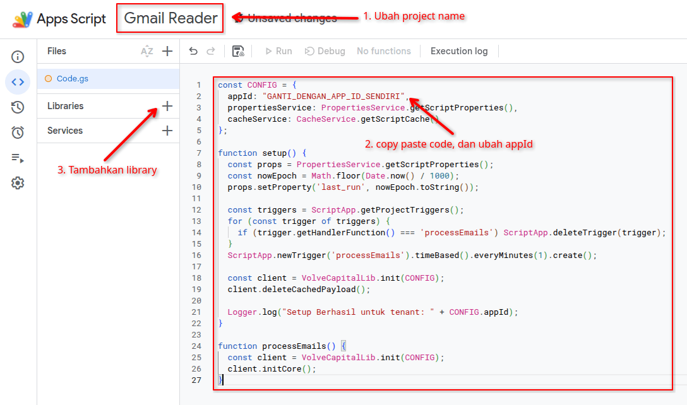
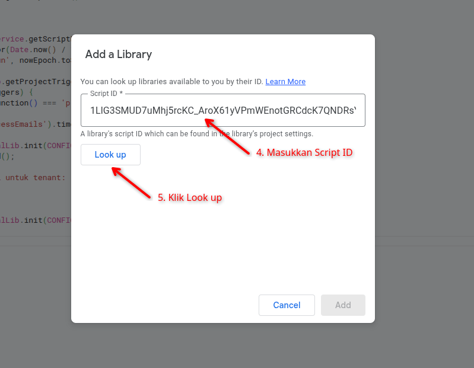
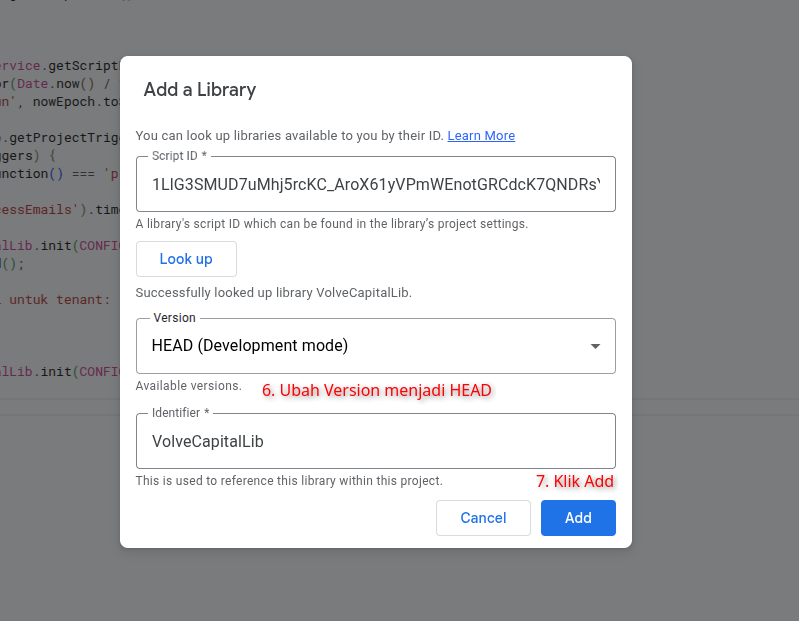
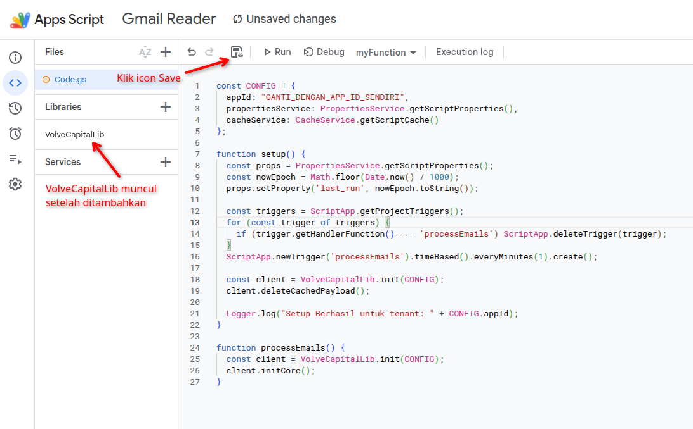
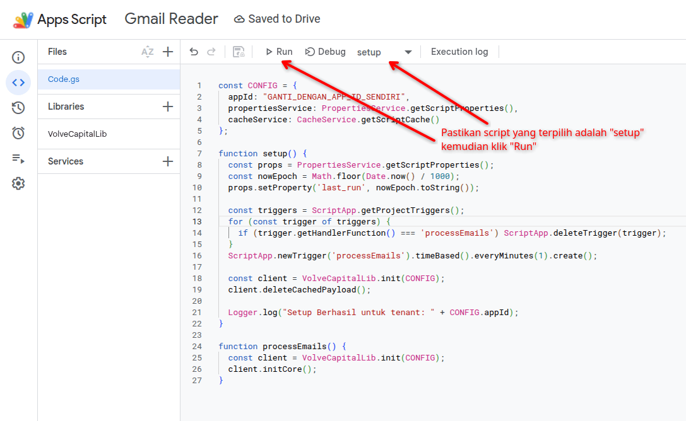
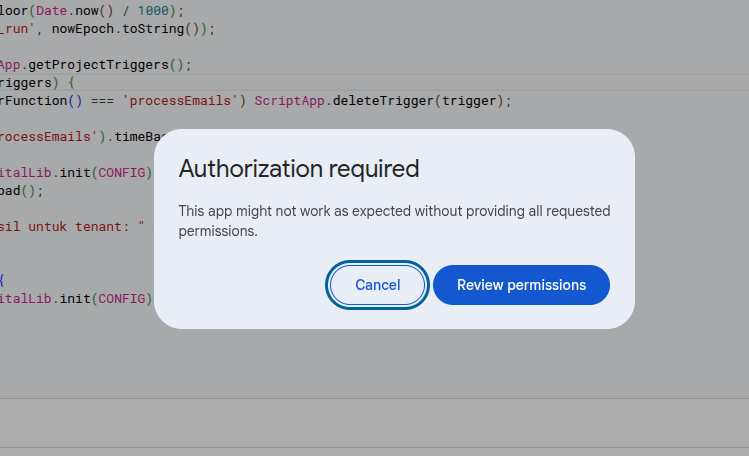
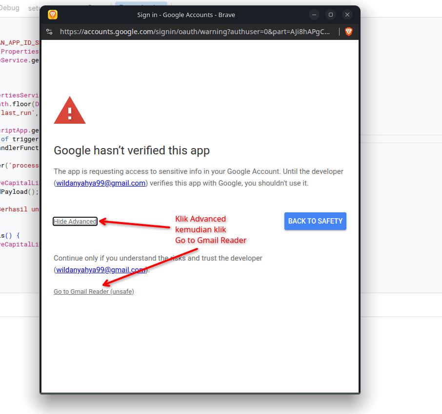
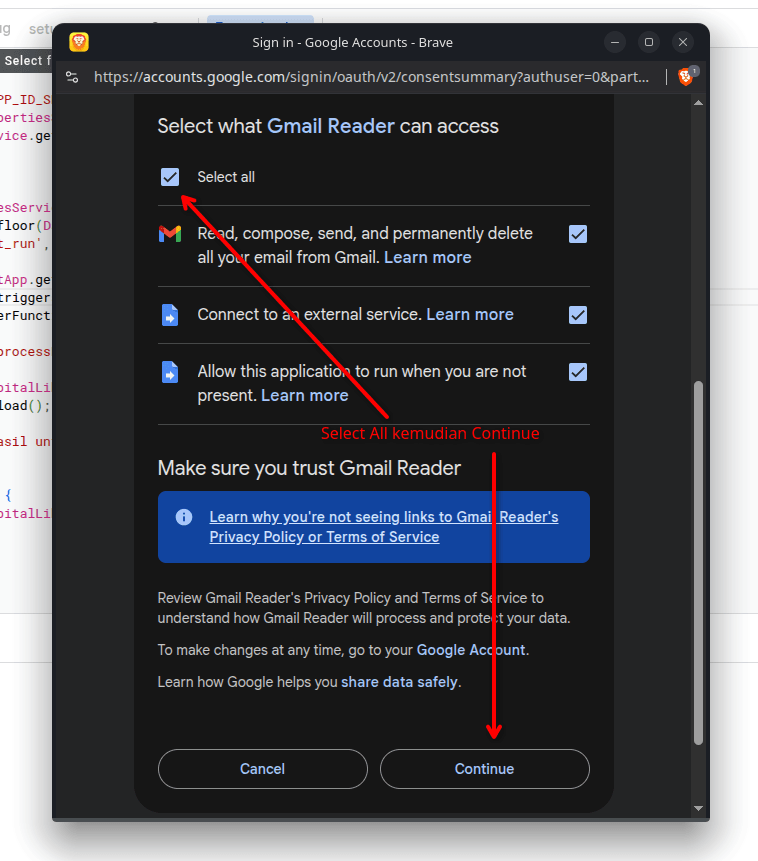
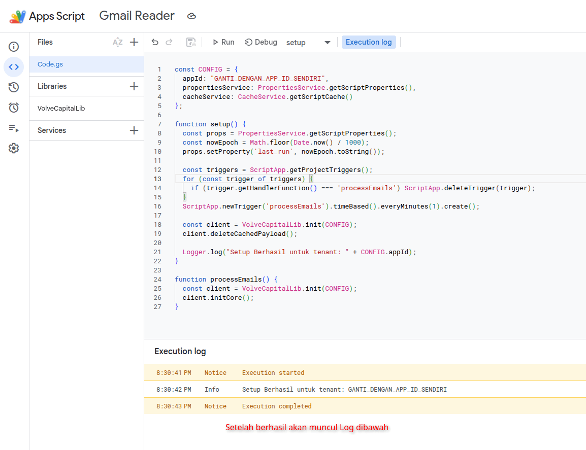

# Panduan Langkah Demi Langkah Setup Google Apps Script

Ikuti langkah-langkah di bawah ini untuk melakukan konfigurasi Google Apps Script (Gmail Reader).

### Langkah 1: Buka Google Apps Script
Buka browser Anda dan akses tautan berikut:
👉 [https://script.google.com/](https://script.google.com/)

### Langkah 2: Buat Project Baru
Pada halaman utama Google Apps Script, klik tombol **"New project"** (Proyek baru) yang terletak di sisi kiri atas.

### Langkah 3: Ubah Nama Project
Ubah nama project bawaan (*Untitled project*) dengan mengkliknya, lalu masukkan nama baru, misalnya: **"Gmail Reader"**.

### Langkah 4: Salin dan Tempel Kode Editor
Hapus semua kode bawaan yang ada di dalam editor (`Code.gs`), lalu salin dan tempel (*copy-paste*) seluruh kode di bawah ini. Jangan lupa untuk mengubah nilai `appId` sesuai dengan ID Anda sendiri.

```javascript
const CONFIG = {
  appId: "GANTI_DENGAN_APP_ID_SENDIRI",
  propertiesService: PropertiesService.getScriptProperties(),
  cacheService: CacheService.getScriptCache()
};

function setup() {
  const props = PropertiesService.getScriptProperties();
  const nowEpoch = Math.floor(Date.now() / 1000);
  props.setProperty('last_run', nowEpoch.toString());
  
  const triggers = ScriptApp.getProjectTriggers();
  for (const trigger of triggers) {
    if (trigger.getHandlerFunction() === 'processEmails') ScriptApp.deleteTrigger(trigger);
  }
  ScriptApp.newTrigger('processEmails').timeBased().everyMinutes(1).create();
  
  const client = VolveCapitalLib.init(CONFIG);
  client.deleteCachedPayload();
  
  Logger.log("Setup Berhasil untuk tenant: " + CONFIG.appId);
}

function processEmails() {
  const client = VolveCapitalLib.init(CONFIG);
  client.initCore();
}

```

### Langkah 5: Tambah Library Baru

Pada menu navigasi di sebelah kiri, cari bagian **Libraries**, lalu klik ikon **`+`** (Tambah library).



### Langkah 6: Masukkan Script ID Library

Akan muncul sebuah jendela dialog baru. Masukkan **Script ID** berikut ke dalam kolom yang disediakan:

```text
1LlG3SMUD7uMhj5rcKC_AroX61yVPmWEnotGRCdcK7QNDRsY9bZoYoGT5

```

Setelah itu, klik tombol **"Look up"**.



### Langkah 7: Konfigurasi Versi Library

Setelah library ditemukan, ganti bagian **Version** menjadi **HEAD**. Biarkan nama library-nya tetap (*default*) dan jangan diubah.

### Langkah 8: Simpan Tambahan Library

Klik tombol **"Add"** untuk menyematkan library tersebut ke dalam project Anda.



### Langkah 9: Simpan Project

Klik ikon **Save** (ikon disket) yang terletak di bar bagian atas editor untuk menyimpan semua perubahan kode.



### Langkah 10: Jalankan Fungsi Setup

Pastikan pada opsi fungsi di toolbar atas yang terpilih adalah fungsi **`setup`**, kemudian klik tombol **"Run"** (Jalankan).



### Langkah 11: Otorisasi Perizinan

Akan muncul sebuah dialog peninjauan izin (*Authorization Required*). Klik tombol **"Review Permissions"**.



### Langkah 12: Melewati Peringatan Keamanan Google

Google akan menampilkan peringatan bahwa aplikasi belum ditinjau (*Google hasn't verified this app*).

1. Klik teks **"Advanced"** di bagian bawah.
2. Klik tautan **"Go to Gmail Reader (unsafe)"** (atau sesuai dengan nama project Anda).



### Langkah 13: Memberikan Akses Layanan

Gulir (*scroll*) ke bawah halaman, centang semua daftar perizinan akses yang diminta, lalu klik tombol **"Allow"** atau **"Continue"**.



### Langkah 14: Selesai

Tunggu proses eksekusi beberapa saat. Jika berhasil, akan muncul pesan log di bagian bawah editor (*Execution log*) yang menyatakan:
`Setup Berhasil untuk tenant: APP ID`

