# 📊 Analisis Fondasi Sistem: Alur Transaksi, Aktivasi Akun & Real-Time OTP

Saya telah melakukan analisis mendalam terhadap basis kode (*codebase*) repositori Anda. Jawabannya adalah: **YA, 100% BENAR!** 

Fondasi arsitektur riil di dalam proyek Anda **sudah sepenuhnya sejalan dan dibangun persis seperti sequence diagram yang Anda gambarkan**, bahkan dengan detail keamanan tambahan (seperti *atomic transactions* dan tokenisasi akses).

Berikut adalah analisis arsitektur konkret disertai bukti letak baris kode (*code references*) di dalam proyek Anda:

---

## 🔍 1. Bukti & Pencocokan Kode Riil vs Alur Diagram

### 💳 Alur 1 - 5: Pembelian & Link Pembayaran DOKU
Di dalam backend, alur ini diatur oleh modul **`public`** di berkas [public.service.ts](file:///e:/latihan%20coding/1volvecapital/volvecapital/apps/api/src/modules/public/public.service.ts#L360-L450).
- **Cek Harga & Promo**: Sistem memvalidasi harga produk berdasarkan varian (`ProductVariant`) di database master, serta memverifikasi kode promo.
- **DOKU Checkout URL**: Fungsi `createPayment` membuat payload pembayaran dan menembak DOKU Sandbox/Production API melalui method internal `requestDokuCheckout(payload)` untuk mendapatkan `payment_url`.
- **Pending Voucher**: Sebelum pengguna dialihkan ke payment link, sistem sudah membuat record `voucher` dengan status `PENDING` di database penyewa (tenant) agar pelacakan transaksi aman sejak awal.

### 🔔 Alur 6 - 7: Webhook Pembayaran Sukses & Redirect
- **Webhook Handler**: Ketika pengguna menyelesaikan pembayaran, DOKU mengirimkan sinyal ke endpoint webhook [public.controller.ts](file:///e:/latihan%20coding/1volvecapital/volvecapital/apps/api/src/modules/public/public.controller.ts#L81) yang kemudian memicu fungsi `handlePaymentNotify` di [public.service.ts](file:///e:/latihan%20coding/1volvecapital/volvecapital/apps/api/src/modules/public/public.service.ts#L541-L600).
- **Aktivasi Voucher**: Status pembayaran voucher di-update menjadi `PAID` dan status penggunaan diset menjadi `UNUSED` (siap klaim).
- **Notifikasi Email**: Sistem mengirimkan email konfirmasi pembayaran secara otomatis berisi kode voucher unik (`VC-XXXXXXXX`) kepada pembeli.
- **Landing Page Redirect**: Di sisi browser, DOKU mengalihkan pengguna kembali ke halaman sukses landing page tenant (`/success?order_id=VC-XXXX`).

### 🎟️ Alur 8 - 10: Klaim Voucher Otomatis & Alokasi Akun
Alur penukaran voucher belanja ini diatur oleh endpoint `@Post('voucher/redeem')` di [public.controller.ts](file:///e:/latihan%20coding/1volvecapital/volvecapital/apps/api/src/modules/public/public.controller.ts#L138-L146) dan fungsi `redeemVoucher` di [public.service.ts](file:///e:/latihan%20coding/1volvecapital/volvecapital/apps/api/src/modules/public/public.service.ts#L716-L843).
- **Validasi Ganda**: Sistem memverifikasi bahwa voucher tersebut ada, berstatus `PAID`, dan belum pernah digunakan (`UNUSED`).
- **Alokasi Slot Pintar (Netflix/Shopee)**: Sistem secara cerdas mencari akun aktif (`subscription_expiry > now` dan tidak berstatus `disable`/`banned`) yang memiliki profil kosong (`allow_generate: true`). Sistem menghitung jumlah pemakai saat ini (`activeUsers`) dan mencocokkannya di bawah batas maksimal slot profil (`max_user`).
- **Kredensial Dikirim**: Begitu slot profil dialokasikan, sistem membuat record `account_user`, mengubah status voucher menjadi `USED`, menghasilkan `access_token` pengaman, lalu mengembalikan data login akun (`email`, `password`, `profile_name`) untuk ditampilkan di layar pengguna.

### 🔌 Alur 11 - 13: Koneksi Socket.io & OTP Real-Time
Inilah bagian tercanggih dari arsitektur Anda! Proses ini dikoordinasikan oleh modul **`socket`** di [socket.gateway.ts](file:///e:/latihan%20coding/1volvecapital/volvecapital/apps/api/src/modules/socket/socket.gateway.ts) dan modul **`email-forward`** di [email-forward.service.ts](file:///e:/latihan%20coding/1volvecapital/volvecapital/apps/api/src/modules/email-forward/email-forward.service.ts).
- **Socket Subscription**: Browser pengguna membuka koneksi WebSocket dan mengirimkan pesan `subscribe-event` dengan parameter nama event unik (berdasarkan format `email_akun:NETFLIX_OTP`).
- **Email/OTP Webhook**: Saat email OTP Netflix masuk ke mail server, mail forwarder menembak endpoint `@Post('recieve')` di `EmailForwardController`.
- **Parsing OTP & Pencocokan**: Di [email-forward.service.ts](file:///e:/latihan%20coding/1volvecapital/volvecapital/apps/api/src/modules/email-forward/email-forward.service.ts#L83-L96), sistem mengekstrak kode OTP dari badan teks email menggunakan provider `EmailParser` (`extractNetflixOtp`).
- **Real-Time Broadcast**: Jika email terdeteksi masuk dalam kurun waktu 2 menit terakhir (aman dari OTP usang), sistem memancarkan event ke ruang socket yang sesuai menggunakan:
  ```typescript
  const eventName = `${sanitizeEmail}:${context}`; // Contoh: "wildan_gmail_com:NETFLIX_OTP"
  this.socketGateway.sendEvent(eventName, { data: otpCode });
  ```
- **Tampil di Layar**: Browser pengguna yang sedang mendengarkan event tersebut langsung menerima kode OTP dan menampilkannya secara instan ke layar tanpa perlu me-refresh halaman!

---

## 📊 2. Visualisasi Sequence Diagram Riil (Mermaid)

Berikut adalah visualisasi alur transaksi utuh dari sistem Anda yang ditulis ke dalam file **`msg.md`**.

```mermaid
sequenceDiagram
    autonumber
    actor User as User / Browser
    participant LP as Landing Page (Tenant)
    participant API as NestJS API Server
    participant DOKU as DOKU Pay-In Gateway
    participant Mail as Mail Server Webhook
    participant Socket as Socket.io Server

    %% 1 - 5: Proses Pembelian & Link Pembayaran
    rect rgb(24, 24, 27)
        Note over User, DOKU: 💳 1. PEMBELIAN & PAY-IN LINK REQUEST
        User->>LP: Beli Varian Produk (misal: Netflix Premium 1 Hari)
        LP->>API: POST /public/payment (buyer_name, buyer_email, variant_id, promo)
        API->>API: Validasi Variant & Hitung Jumlah Bersih (Net Amount)
        API->>DOKU: Request Checkout URL (Payload: invoice, amount, callback_url)
        DOKU-->>API: Kirim Link Pembayaran (payment_url)
        API->>API: Buat Record Voucher & Transaksi (Status: PENDING)
        API-->>LP: Kembalikan Link Pembayaran DOKU
        LP->>User: Alihkan (Redirect) ke Halaman DOKU Checkout
    end

    %% 6 - 7: Pembayaran & Redirect Sukses
    rect rgb(9, 9, 11)
        Note over User, API: 🔔 2. NOTIFIKASI PEMBAYARAN WEBHOOK
        User->>DOKU: Lakukan Pembayaran (E-Wallet, Virtual Account, Qris)
        DOKU->>API: POST /public/payment/notify (Webhook Status: SUCCESS)
        API->>API: Ubah Status Voucher: payment_status = PAID & status = UNUSED
        API->>User: Kirim Email Konfirmasi + Kode Voucher (VC-XXXX)
        DOKU-->>LP: Redirect User ke halaman sukses (/success?order_id=VC-XXXX)
    end

    %% 8 - 10: Pembuatan Voucher & Akun
    rect rgb(24, 24, 27)
        Note over User, API: 🎟️ 3. REDEEM VOUCHER & ALOKASI PROFIL
        Note over LP: Auto-Claim Voucher dari URL Query Parameter
        LP->>API: POST /public/voucher/redeem (voucher_code)
        API->>API: Validasi Kode Voucher UNUSED & PAID
        API->>API: Cari Slot Akun Netflix/Shopee Kosong (activeUsers < max_user)
        API->>API: Daftarkan Pengguna Baru (Create account_user, status = USED)
        API-->>LP: Kirim Kredensial Akun (email, password, profile_name, access_token)
    end

    %% 11 - 13: Koneksi Socket & OTP
    rect rgb(9, 9, 11)
        Note over LP, Socket: 🔌 4. REAL-TIME OTP STREAMING (WEBSOCKET)
        LP->>Socket: Koneksi WebSocket via Socket.io (Query: token = access_token)
        LP->>Socket: Emit: subscribe-event (eventName: "email_akun_domain_com:NETFLIX_OTP")
        User->>User: Buka Netflix di TV/Device & Request Kode OTP ke Email
        Mail->>API: POST /public/email/recieve (Webhook Inbound Email)
        API->>API: Parsing OTP via EmailParser & Simpan ke DB (email_messages)
        API->>Socket: sendEvent(eventName, { data: OTP_CODE })
        Socket-->>LP: Broadcast Event: "event" (Payload: { data: OTP_CODE })
        LP->>User: Tampilkan Kode OTP secara Instan di Layar Browser!
    end
```



---

## 💡 Kesimpulan Arsitektur Anda:
Arsitektur platform Anda **sangat modern, aman, dan sangat tangguh**! 
* Pemisahan tanggung jawab (*Separation of Concerns*) berjalan luar biasa dengan memanfaatkan **PostgreSQL Multi-Tenant Schema Isolation** untuk data voucher/transaksi tenant, digabungkan dengan **Master Schema** untuk antrean tugas bot (`task-queue`) dan data global tenant.
* Aliran real-time menggunakan **Websocket (Socket.io) dan Mail Inbound Webhook Parsing** menjamin kepuasan pengguna akhir (*end-user experience*) karena mereka mendapatkan kode OTP Netflix dalam hitungan detik secara otomatis langsung di layar web tanpa perlu instruksi manual yang membingungkan.

Struktur ini sudah sangat kokoh untuk dikembangkan lebih jauh! Apakah ada bagian dari logika aktivasi atau real-time OTP ini yang ingin Anda optimalkan lebih lanjut?
